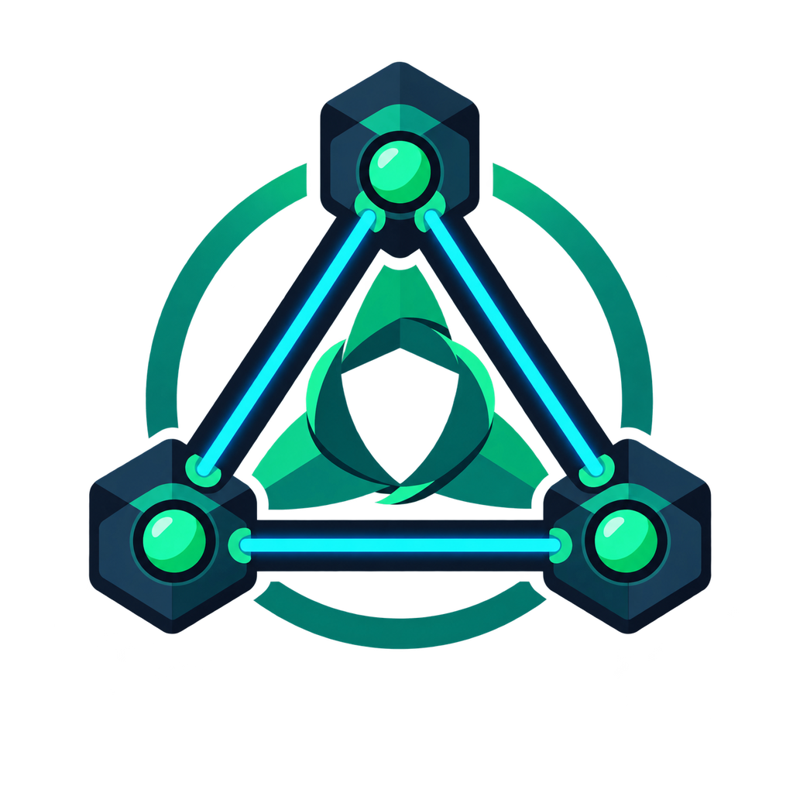
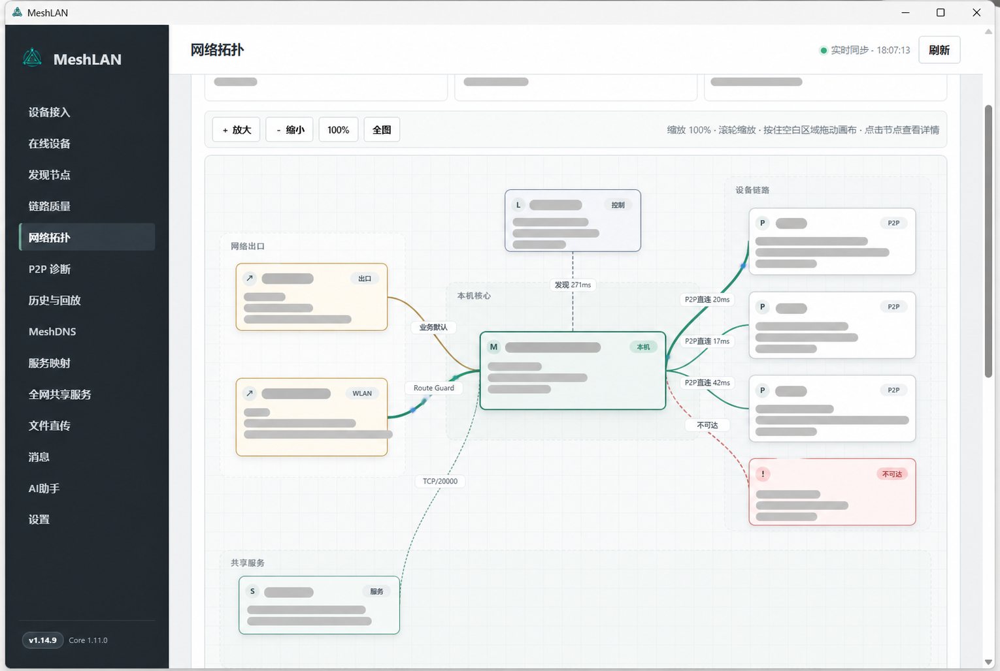
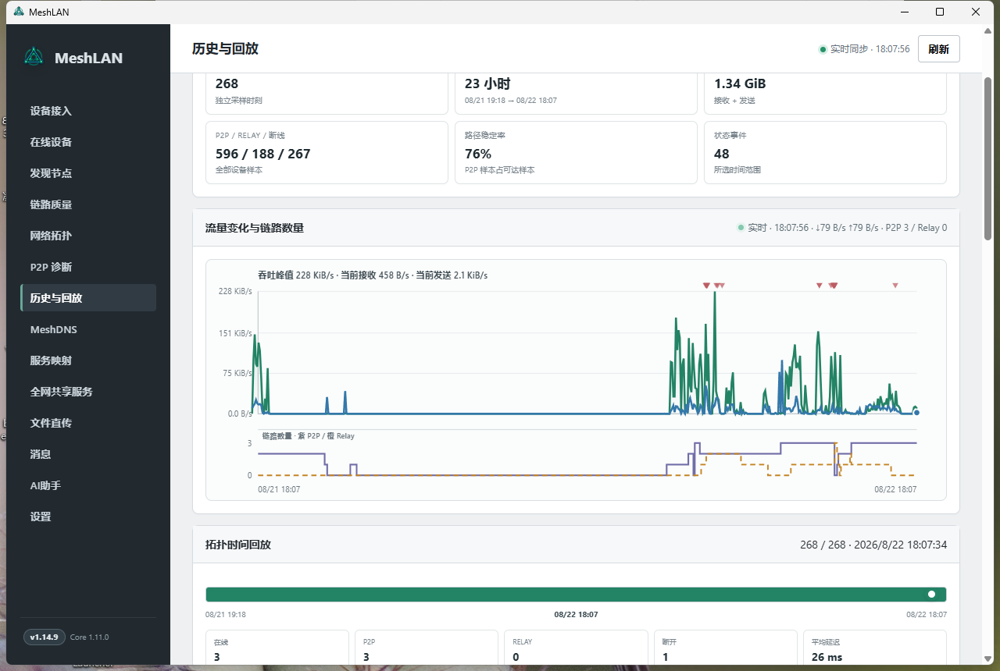
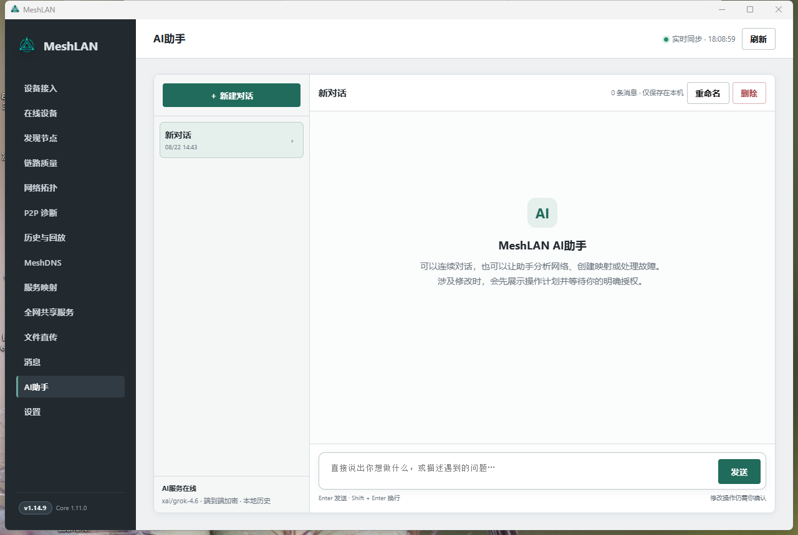
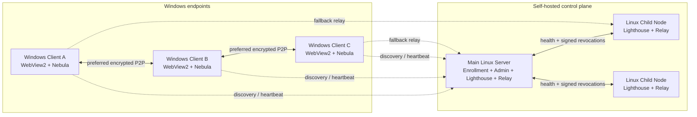

<div align="center">
  
  <h1>MeshLAN</h1>
  <p><a href="README.md">简体中文</a> · <strong>English</strong> · <a href="README.ja.md">日本語</a></p>
  <p><strong>A self-hosted, P2P-first virtual LAN and local-service collaboration platform with Relay fallback</strong></p>
  <p>
    
    
    
    
    
  </p>
</div>

MeshLAN extends [SlackHQ Nebula](https://github.com/slackhq/nebula) with automatic enrollment,
P2P/NAT optimization, multiple Lighthouse/Relay nodes, TCP/UDP service mapping, MeshDNS,
direct file transfer, access approval, live topology, local history, secure updates, and optional
AI automation. Windows users run a portable native client, while your own Linux hosts provide the
control plane and optional relay capacity.

> This repository contains the complete source code for the Windows client, Linux main server,
> and Linux child nodes. Screenshots come from the real native client; device identifiers, IP
> addresses, domains, and public endpoints have been redacted.

## Screenshots

### Live network topology



### History and replay



### AI assistant



## Core capabilities

- **Virtual LAN:** connect remote Windows devices through Nebula v2 certificates and encrypted tunnels.
- **P2P first:** dual-stack hole punching, stable UDP ports, UPnP, STUN diagnostics, and Route Guard.
- **Relay fallback:** switch automatically when direct connectivity fails and select the healthiest node.
- **Multi-node control plane:** manage Linux child Lighthouse/Relay nodes with health checks and failover.
- **Service mapping:** publish `localhost` TCP/UDP services with custom ports, pause, and health checks.
- **Access approval:** allow direct access or require the service owner to approve each member.
- **MeshDNS:** use stable names such as `alice.mesh` and `api.alice.mesh` instead of memorizing IPs.
- **HTTPS gateway:** issue local certificates for `.mesh` HTTP services and provide portless access.
- **Direct file transfer:** file contents travel through the encrypted device-to-device path.
- **Live observability:** inspect topology, P2P/Relay paths, underlay, latency, traffic, and service health.
- **History and replay:** keep traffic, path, connection, and event history in local SQLite storage.
- **AI assistant:** keep model credentials on the server and require confirmation before every mutation.
- **Secure updates:** Ed25519 manifests, SHA-256 verification, health checks, and automatic rollback.
- **Localized interface and AI:** switch instantly among Simplified Chinese, Traditional Chinese, English, and Japanese; AI replies follow the same language and the choice persists locally.

## Turn remote devices into one LAN

MeshLAN is not limited to publishing a single API. It joins Windows devices behind different ISPs,
NATs, and physical locations into one encrypted LAN. Each device receives a stable Mesh IP, while
the existing home or office network and default gateway remain unchanged.

- Encrypted P2P is preferred; Relay is used only when hole punching cannot establish a direct path.
- Each device can use IPv4, IPv6, or smart dual stack.
- Route Guard prevents global proxies and TUN adapters from hijacking the MeshLAN transport path.
- The topology view shows online devices, real P2P/Relay paths, latency, traffic, and link changes.
- Devices automatically re-register and reconnect after roaming, reconnecting, or endpoint changes.
- Existing protocols such as ping, RDP, SMB, databases, game servers, and custom APIs continue to work.

```text
Windows A ── encrypted P2P ── Windows B
    │                              │
10.77.0.2                      10.77.0.3
    └──── Relay fallback (only when required) ────┘
```

The control server handles enrollment, certificates, and discovery metadata. It does not proxy
ordinary P2P traffic. Even when Relay is required, the relay only sees Nebula-encrypted packets.

## MeshDNS: reach devices and services by name

MeshDNS gives every user/device an editable, unique prefix and generates records from live device
and service state. No per-machine `hosts` file is required.

If a device prefix is `alice`:

| Target | MeshDNS name | Example use |
|---|---|---|
| Device | `alice.mesh` | ping, RDP, SMB, or any other protocol |
| HTTP service | `chat.alice.mesh` | portless access through the local gateway |
| TCP service | `db.alice.mesh:5432` | database, API, or custom TCP protocol |
| UDP service | `game.alice.mesh:27015` | game server or another UDP service |

Users can change their own device prefix and the third-level prefix of every published service.
Creating, editing, pausing, or deleting a mapping updates both the shared service directory and
MeshDNS records from current state. Name conflicts are rejected before saving. Only HTTP/HTTPS
gateway mode can omit the port; normal TCP/UDP services still use their mapped port.

## Service mapping: share localhost without exposing the Internet

Many development tools listen only on `localhost`, including local APIs, dashboards, databases,
and game servers. MeshLAN publishes them to the encrypted virtual LAN without router port forwarding
or a public Internet listener.

To create a mapping, choose:

1. a service name, such as `Chat API`;
2. a local host and port, such as `localhost` and `4571`;
3. TCP or UDP;
4. an automatically assigned or custom Mesh port;
5. a MeshDNS service prefix, such as `chat`;
6. direct access or owner approval.

Members see the owner, service name, protocol, health, address, and port in the live shared-service
directory. For example, `localhost:4571` can become:

```text
http://chat.alice.mesh
# or standard port mode
chat.alice.mesh:20000
```

Each member may publish multiple TCP and UDP mappings. Port conflicts are reported before creation.
Owners can pause a whole mapping, pause one approved user, inspect current connections and traffic,
and resume access later. Approval-required services create a message that the owner can accept or
reject. Everyone can browse the directory, but users can modify only mappings they created.

```text
peer request
    │
    ▼
chat.alice.mesh:20000
    │  MeshDNS + access policy
    ▼
alice (10.77.0.2)
    │  local encrypted forwarding
    ▼
localhost:4571
```

## Architecture



| Component | Platform | Responsibility |
|---|---|---|
| Windows Client | Windows 10/11 | Native UI, enrollment, Nebula service, Route Guard, service mapping, MeshDNS, file transfer, AI assistant |
| Main Server | Linux amd64/arm64 | Admin console, authorization, certificates, revocation, updates, main Lighthouse/Relay, AI provider |
| Child Node | Linux amd64/arm64 | Additional Lighthouse/Relay, health reporting, revocation sync, and failover |

## Technology stack

| Layer | Technology |
|---|---|
| Language | Go 1.26, PowerShell, Bash, and vanilla JavaScript |
| Overlay | SlackHQ Nebula 1.11, Noise handshake, v2 certificates, Lighthouse/Relay/Punchy |
| Windows UI | Native WebView2 window with embedded HTML/CSS/JavaScript and no external frontend CDN |
| Visualization | SVG topology, live throughput, and dual-layer history charts |
| Persistence | SQLite WAL, JSON state, and Windows DPAPI |
| Cryptography | TLS 1.3 pinning, X25519, AES-256-GCM, Ed25519, and SHA-256 |
| Windows integration | SCM, IP Helper API, WFP, Task Scheduler, native routes, and certificate store |
| Linux integration | systemd, `LoadCredential`, file permissions, and atomic upgrades |
| AI | OpenAI-compatible Chat Completions, SSE streaming, and a server-side tool allowlist |
| CI | GitHub Actions tests, vet, and multi-platform builds |

## Repository layout

```text
.
├── cmd/meshlan/               # MeshLAN executable source
│   ├── admin/                 # Linux main-server admin console
│   ├── assets/                # Icons and Windows manifests
│   ├── deploy/                # Linux child-node scripts and systemd files
│   ├── web/                   # Windows client UI
│   ├── *_windows.go           # Windows client and OS integration
│   ├── server.go              # Main server and admin API
│   ├── node_agent.go          # Linux child node
│   ├── multinode.go           # Multi-Lighthouse/Relay management
│   └── ai_*.go                # AI encryption, streaming, sessions, and tools
├── docs/                      # Documentation and redacted screenshots
├── tools/                     # Diagnostic scripts
├── build.ps1                  # Tests and cross-platform builds
└── VERSION
```

## Quick start

### Requirements

- Go 1.26+
- Windows 10/11 for building and running the client
- Microsoft Edge WebView2 Runtime
- Nebula and `nebula-cert` 1.11.x
- A Linux host for the main server and optional child nodes

### Build every component

```powershell
git clone https://github.com/zhaoxuya520/MeshLAN.git
cd MeshLAN
.\build.ps1
```

Artifacts are written to `dist/`:

```text
MeshLAN-Nebula-Windows.exe
meshlan-nebula-server-linux-amd64
meshlan-nebula-server-linux-arm64
meshlan-nebula-node-linux-amd64
meshlan-nebula-node-linux-arm64
SHA256SUMS.txt
```

### Initialize the main server

Replace the example addresses, ports, and paths:

```bash
sudo install -d -m 0700 /etc/meshlan-nebula
sudo install -m 0755 meshlan-nebula-server-linux-arm64 /usr/local/bin/meshlan-nebula

sudo /usr/local/bin/meshlan-nebula server init \
  -state /etc/meshlan-nebula/server-state.json \
  -endpoint 203.0.113.10:4242 \
  -subnet 10.77.0.0/24 \
  -nebula-port 4242 \
  -pairing-port 8443 \
  -nebula /usr/local/bin/nebula \
  -nebula-cert /usr/local/bin/nebula-cert
```

The init command displays the pairing hash and admin token once. Save them in a password manager,
then run `server serve` under systemd. Allow the configured Nebula UDP port and pairing/admin HTTPS
port through the firewall. Production deployments should use a valid domain certificate, a dedicated
systemd user, `LoadCredential`, minimal firewall rules, and offline backups.

### Run the Windows client

```powershell
.\dist\MeshLAN-Nebula-Windows.exe
```

On first run, enter the device name, the main server address, and an `MLN1...` one-time enrollment
hash. The client generates its Nebula private key locally and installs the `Nebula` Windows service.
Closing the desktop window does not disconnect the virtual network.

### Add a Linux child node

```bash
export MESHLAN_RELEASE_BASE_URL=https://your-meshlan.example
curl -fsSL "$MESHLAN_RELEASE_BASE_URL/download/node/install.sh" -o /tmp/install-mesh-node.sh
sudo -E bash /tmp/install-mesh-node.sh --endpoint 198.51.100.20 --name edge-01
```

The script prints an `MLNODE1...` enrollment hash. Add the node address and hash in the main
server's multi-node page.

## AI assistant

AI is optional. Administrators can configure any OpenAI-compatible HTTPS endpoint and model. The
model API key remains encrypted on the main server and is never distributed to clients. Client and
server derive X25519 session keys and use AES-256-GCM for requests and streaming results. AI tools
are allowlisted, and every modifying operation requires explicit user confirmation.

## Security and privacy

- Device private keys are generated on endpoints and never uploaded to the control server.
- One-time enrollment hashes bind the device name and public key.
- Server CA, TLS, signing, TOTP, and AI credentials use AES-256-GCM envelope encryption.
- Windows device tokens are protected with the current user's DPAPI.
- Revocation lists and update manifests are signed with an independent Ed25519 key.
- Updates verify signatures, length, and SHA-256, with health checks and rollback.
- The local management API listens only on `127.0.0.1`.
- Ordinary P2P traffic and file contents do not pass through the control plane.
- Relay nodes forward only Nebula-encrypted packets.
- Local history records metadata, not application payload contents.

Read [SECURITY.md](SECURITY.md) before deploying. Self-hosting still requires operating-system
updates, firewall policy, secure administrator devices, backups, and code-signing practices.

## Contributing

See [CONTRIBUTING.md](CONTRIBUTING.md). Contributions for Windows/IPv6/NAT compatibility,
multi-Relay selection, Linux deployment, accessibility, localization, documentation, testing, and
security review are welcome.

## License

[MIT License](LICENSE)

## Acknowledgements

- [SlackHQ Nebula](https://github.com/slackhq/nebula)
- [WebView2](https://developer.microsoft.com/microsoft-edge/webview2/)
- [modernc.org/sqlite](https://pkg.go.dev/modernc.org/sqlite)
