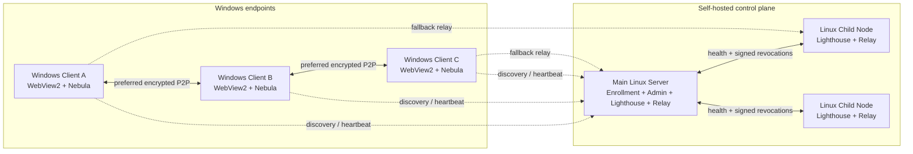

<div align="center">
  
  <h1>MeshLAN</h1>
  <p><a href="README.md">简体中文</a> · <a href="README.en.md">English</a> · <strong>日本語</strong></p>
  <p><strong>P2P を優先し、Relay をフォールバックに使うセルフホスト型仮想 LAN／ローカルサービス共有基盤</strong></p>
  <p>
    
    
    
    
    
  </p>
</div>

MeshLAN は [SlackHQ Nebula](https://github.com/slackhq/nebula) を基盤に、自動ペアリング、
P2P/NAT 最適化、複数 Lighthouse/Relay、TCP/UDP サービスマッピング、MeshDNS、
ファイル直接転送、アクセス承認、リアルタイムトポロジー、履歴、安全な更新、任意の
AI 自動化を統合します。Windows 側はポータブルなネイティブクライアントを実行し、
コントロールプレーンと中継ノードは自分の Linux サーバーで運用します。

> このリポジトリには Windows クライアント、Linux メインサーバー、Linux 子ノードの
> 完全なソースコードが含まれます。スクリーンショットは実際のネイティブクライアント
> から取得し、端末名、IP、IPv6、ドメイン、公開エンドポイントをマスクしています。

## スクリーンショット

### リアルタイムネットワークトポロジー


### 履歴とリプレイ


### AI アシスタント


## 主な機能

- **仮想 LAN：** Nebula v2 証明書と暗号化トンネルで離れた Windows 端末を接続。
- **P2P 優先：** デュアルスタックのホールパンチ、固定 UDP ポート、UPnP、STUN 診断、Route Guard。
- **Relay フォールバック：** 直接接続できない場合だけ自動中継し、品質の良いノードを選択。
- **マルチノード：** Linux 子 Lighthouse/Relay のヘルスチェックとフェイルオーバー。
- **サービスマッピング：** `localhost` の TCP/UDP サービスを Mesh 内へ公開。
- **アクセス承認：** 即時アクセスまたは所有者による個別承認を選択可能。
- **MeshDNS：** `alice.mesh`、`api.alice.mesh` のような安定した名前でアクセス。
- **HTTPS ゲートウェイ：** `.mesh` HTTP サービス向けローカル証明書とポート不要アクセス。
- **ファイル直接転送：** ファイル本体を端末間の暗号化経路で転送。
- **可観測性：** P2P/Relay 経路、Underlay、遅延、トラフィック、サービス状態をリアルタイム表示。
- **履歴とリプレイ：** ローカル SQLite に通信量、経路、接続、イベントを保存。
- **AI アシスタント：** モデルの認証情報はサーバーに保持し、変更操作には利用者の確認が必須。
- **安全な更新：** Ed25519 署名、SHA-256 検証、ヘルスチェック、自動ロールバック。
- **多言語 UI：** 簡体字中国語、繁体字中国語、英語、日本語を即時切替し、選択を端末内に保存。

## 離れた端末を一つの LAN にする

MeshLAN は単一 API を公開するだけのトンネルではありません。異なる ISP、地域、NAT
配下にある Windows 端末を一つの暗号化 LAN に参加させます。各端末には安定した Mesh
IP が割り当てられ、既存の家庭内／社内ネットワークやデフォルトゲートウェイは変更しません。

- 端末間は暗号化 P2P を優先し、ホールパンチに失敗した場合だけ Relay に切り替えます。
- 端末ごとに IPv4、IPv6、スマートデュアルスタックを選択できます。
- Route Guard がグローバルプロキシや TUN による MeshLAN 経路の横取りを防ぎます。
- トポロジー画面にオンライン端末、実際の P2P/Relay 経路、遅延、通信量を表示します。
- ネットワーク切替や公開エンドポイント変更後は自動的に再登録・再接続します。
- ping、RDP、SMB、データベース、ゲームサーバー、自作 API など既存プロトコルを利用できます。

```text
Windows A ── encrypted P2P ── Windows B
    │                              │
10.77.0.2                      10.77.0.3
    └──── Relay fallback（必要な場合のみ）────┘
```

コントロールサーバーは端末認可、証明書、探索メタデータを管理します。通常の P2P
データは代理転送しません。Relay 使用時も、中継ノードが扱うのは Nebula で暗号化された
パケットだけです。

## MeshDNS：端末とサービスを名前で利用

MeshDNS は各ユーザー／端末に変更可能で一意なプレフィックスを割り当て、現在の端末・
サービス状態からレコードをリアルタイム生成します。各 PC の `hosts` を手作業で編集する
必要はありません。

端末プレフィックスが `alice` の場合：

| 対象 | MeshDNS 名 | 利用例 |
|---|---|---|
| 端末 | `alice.mesh` | ping、RDP、SMB、その他のプロトコル |
| HTTP サービス | `chat.alice.mesh` | ローカルゲートウェイ経由のポート不要アクセス |
| TCP サービス | `db.alice.mesh:5432` | DB、API、独自 TCP プロトコル |
| UDP サービス | `game.alice.mesh:27015` | ゲームサーバー、その他の UDP サービス |

利用者は自分の端末プレフィックスと、公開済みサービスごとの第 3 レベルプレフィックスを
変更できます。マッピングの作成、編集、一時停止、削除に合わせて共有サービス一覧と
MeshDNS レコードが更新されます。名前の競合は保存前に拒否されます。ポートを省略できる
のは HTTP/HTTPS ゲートウェイモードだけで、通常の TCP/UDP はマッピングポートを使います。

## サービスマッピング：localhost をインターネットへ公開せず共有

ローカル API、管理画面、データベース、ゲームサーバーなど、多くの開発用サービスは
`localhost` のみで待ち受けます。MeshLAN はルーターのポート転送や公開リスナーを使わず、
それらを暗号化仮想 LAN 内へ公開します。

マッピング作成時に指定する項目：

1. `Chat API` などのサービス名。
2. `localhost` と `4571` などのローカルホスト／ポート。
3. TCP または UDP。
4. 自動割当または任意の Mesh ポート。
5. `chat` などの MeshDNS サービスプレフィックス。
6. 即時アクセスまたは所有者承認。

同じ Mesh のメンバーは、共有サービス一覧で所有者、名称、プロトコル、ヘルス状態、
アクセス先、ポートをリアルタイム確認できます。例えば `localhost:4571` を次のように
公開できます。

```text
http://chat.alice.mesh
# または通常のポートモード
chat.alice.mesh:20000
```

各ユーザーは複数の TCP/UDP マッピングを同時に公開できます。ポート競合は作成前に
明示されます。所有者はマッピング全体または承認済みユーザー単位で一時停止し、現在の
接続者と通信量を確認して後から再開できます。承認制サービスでは申請メッセージが作成
され、所有者が許可または拒否します。共有一覧は全員が閲覧できますが、編集・削除できる
のは自分が作成したマッピングだけです。

```text
peer request
    │
    ▼
chat.alice.mesh:20000
    │  MeshDNS + access policy
    ▼
alice (10.77.0.2)
    │  local encrypted forwarding
    ▼
localhost:4571
```

## アーキテクチャ



| コンポーネント | プラットフォーム | 役割 |
|---|---|---|
| Windows Client | Windows 10/11 | ネイティブ UI、登録、Nebula サービス、Route Guard、サービスマッピング、MeshDNS、ファイル転送、AI |
| Main Server | Linux amd64/arm64 | 管理画面、端末認可、証明書、失効、更新配信、メイン Lighthouse/Relay、AI Provider |
| Child Node | Linux amd64/arm64 | 追加 Lighthouse/Relay、ヘルス報告、失効同期、フェイルオーバー |

## 技術スタック

| レイヤー | 技術 |
|---|---|
| 言語 | Go 1.26、PowerShell、Bash、Vanilla JavaScript |
| Overlay | SlackHQ Nebula 1.11、Noise ハンドシェイク、v2 証明書、Lighthouse/Relay/Punchy |
| Windows UI | WebView2 ネイティブウィンドウ、埋め込み HTML/CSS/JavaScript、外部 CDN なし |
| 可視化 | SVG トポロジー、リアルタイム通信量、履歴グラフ |
| 永続化 | SQLite WAL、JSON 状態、Windows DPAPI |
| 暗号 | TLS 1.3 pinning、X25519、AES-256-GCM、Ed25519、SHA-256 |
| Windows 連携 | SCM、IP Helper API、WFP、タスクスケジューラ、ルート、証明書ストア |
| Linux 連携 | systemd、`LoadCredential`、ファイル権限、アトミック更新 |
| AI | OpenAI 互換 Chat Completions、SSE ストリーミング、サーバー側ツール許可リスト |
| CI | GitHub Actions による Windows/Linux テスト、vet、マルチプラットフォームビルド |

## リポジトリ構成

```text
.
├── cmd/meshlan/               # MeshLAN 実行プログラムのソース
│   ├── admin/                 # Linux メインサーバー管理画面
│   ├── assets/                # アイコンと Windows manifest
│   ├── deploy/                # Linux 子ノードのスクリプトと systemd 設定
│   ├── web/                   # Windows クライアント UI
│   ├── *_windows.go           # Windows クライアント／OS 連携
│   ├── server.go              # メインサーバーと管理 API
│   ├── node_agent.go          # Linux 子ノード
│   ├── multinode.go           # 複数 Lighthouse/Relay 管理
│   └── ai_*.go                # AI 暗号化、ストリーム、会話、ツール
├── docs/                      # ドキュメントとマスク済み画像
├── tools/                     # 診断スクリプト
├── build.ps1                  # テストとクロスプラットフォームビルド
└── VERSION
```

## クイックスタート

### 必要環境

- Go 1.26+
- クライアントのビルド／実行用 Windows 10/11
- Microsoft Edge WebView2 Runtime
- Nebula と `nebula-cert` 1.11.x
- メインサーバーおよび任意の子ノード用 Linux ホスト

### 全コンポーネントをビルド

```powershell
git clone https://github.com/zhaoxuya520/MeshLAN.git
cd MeshLAN
.\build.ps1
```

成果物は `dist/` に生成されます。

```text
MeshLAN-Nebula-Windows.exe
meshlan-nebula-server-linux-amd64
meshlan-nebula-server-linux-arm64
meshlan-nebula-node-linux-amd64
meshlan-nebula-node-linux-arm64
SHA256SUMS.txt
```

### メインサーバーを初期化

次の公開アドレス、ポート、パスは実環境に合わせて変更してください。

```bash
sudo install -d -m 0700 /etc/meshlan-nebula
sudo install -m 0755 meshlan-nebula-server-linux-arm64 /usr/local/bin/meshlan-nebula

sudo /usr/local/bin/meshlan-nebula server init \
  -state /etc/meshlan-nebula/server-state.json \
  -endpoint 203.0.113.10:4242 \
  -subnet 10.77.0.0/24 \
  -nebula-port 4242 \
  -pairing-port 8443 \
  -nebula /usr/local/bin/nebula \
  -nebula-cert /usr/local/bin/nebula-cert
```

初期化時にペアリングハッシュと管理トークンが一度だけ表示されます。パスワード管理
ツールに保存した後、systemd で `server serve` を実行してください。設定した Nebula UDP
ポートとペアリング／管理 HTTPS ポートをファイアウォールで許可します。本番環境では
有効なドメイン証明書、専用 systemd ユーザー、`LoadCredential`、最小限の許可ルール、
オフラインバックアップを推奨します。

### Windows クライアントを実行

```powershell
.\dist\MeshLAN-Nebula-Windows.exe
```

初回起動時に端末名、メインサーバーのアドレス、`MLN1...` ワンタイム登録ハッシュを
入力します。Nebula 秘密鍵はクライアント上で生成され、`Nebula` Windows サービスが
インストールされます。デスクトップウィンドウを閉じても仮想ネットワークは切断されません。

### Linux 子ノードを追加

```bash
export MESHLAN_RELEASE_BASE_URL=https://your-meshlan.example
curl -fsSL "$MESHLAN_RELEASE_BASE_URL/download/node/install.sh" -o /tmp/install-mesh-node.sh
sudo -E bash /tmp/install-mesh-node.sh --endpoint 198.51.100.20 --name edge-01
```

スクリプトが表示する `MLNODE1...` 登録ハッシュとノードアドレスを、メインサーバーの
マルチノード画面に入力します。

## AI アシスタント

AI は任意機能です。管理者は OpenAI 互換 HTTPS エンドポイントとモデルを設定できます。
API キーはメインサーバーで暗号化され、クライアントへ配布されません。クライアントと
サーバーは X25519 でセッション鍵を導出し、要求とストリーム結果を AES-256-GCM で
暗号化します。AI が利用できるツールは許可リストで制限され、変更操作には必ず利用者の
明示的な確認が必要です。

## セキュリティとプライバシー

- 端末秘密鍵は各端末で生成され、コントロールサーバーへアップロードされません。
- ワンタイム登録ハッシュは端末名と公開鍵に結び付けられます。
- サーバー CA、TLS、署名、TOTP、AI 認証情報は AES-256-GCM envelope で保護されます。
- Windows 端末トークンは現在のユーザーの DPAPI で保護されます。
- 失効リストと更新マニフェストは独立した Ed25519 鍵で署名されます。
- 更新では署名、サイズ、SHA-256 を検証し、ヘルスチェック失敗時にロールバックします。
- ローカル管理 API は `127.0.0.1` のみで待ち受けます。
- 通常の P2P データとファイル本体はコントロールプレーンを通過しません。
- Relay は Nebula で暗号化されたパケットだけを転送します。
- ローカル履歴はメタデータのみを保存し、アプリケーションの本文は記録しません。

導入前に [SECURITY.md](SECURITY.md) を確認してください。セルフホストでも OS 更新、
ファイアウォール、管理端末、バックアップ、コード署名の適切な運用が必要です。

## コントリビューション

[CONTRIBUTING.md](CONTRIBUTING.md) を参照してください。Windows/IPv6/NAT 互換性、
複数 Relay 選択、Linux デプロイ、アクセシビリティ、多言語化、ドキュメント、テスト、
セキュリティレビューへの貢献を歓迎します。

## ライセンス

[MIT License](LICENSE)

## 謝辞

- [SlackHQ Nebula](https://github.com/slackhq/nebula)
- [WebView2](https://developer.microsoft.com/microsoft-edge/webview2/)
- [modernc.org/sqlite](https://pkg.go.dev/modernc.org/sqlite)
